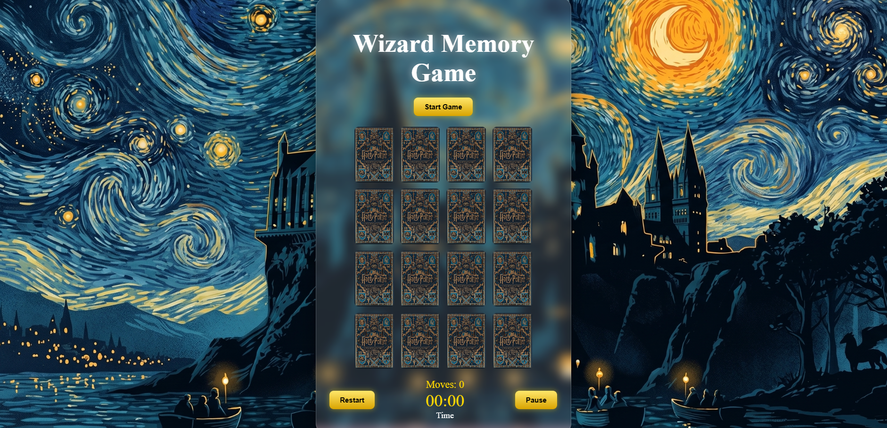
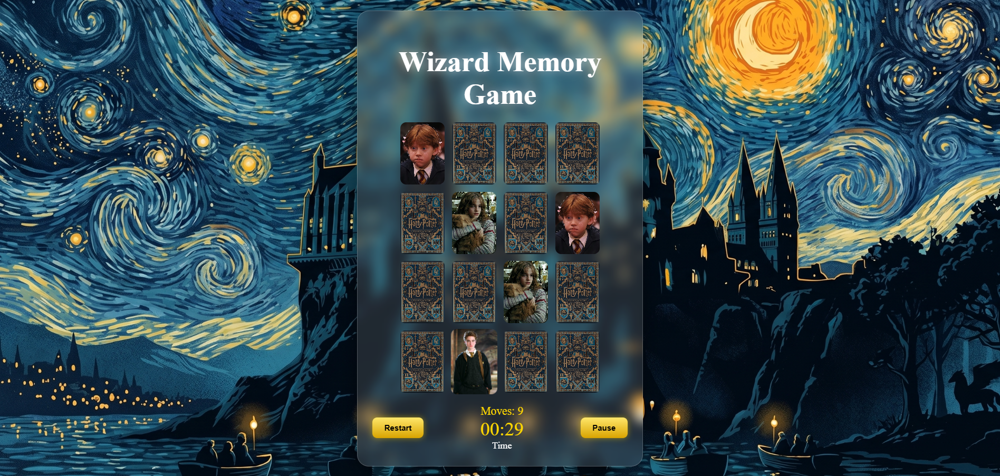
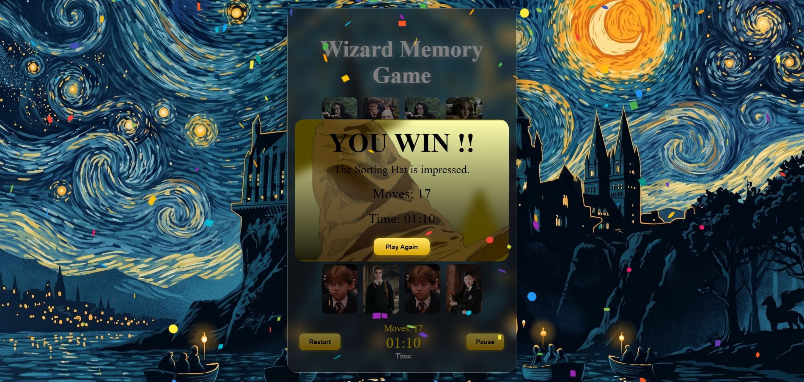

#  Harry Potter Memory Game

A Harry Potter themed memory matching game built with React.

## Features

- Card Flip Animations
- Timer and Move Counter
- Pause and Resume
- Custom Sorting Hat Win Screen
- Confetti Celebration
- Hogwarts Inspired Design

## Screenshots

### Game Board



### Gameplay



### Win Screen



## Technologies Used

- React
- JavaScript
- CSS
- Vite

## Run Locally

```bash
npm install
npm run dev
```
